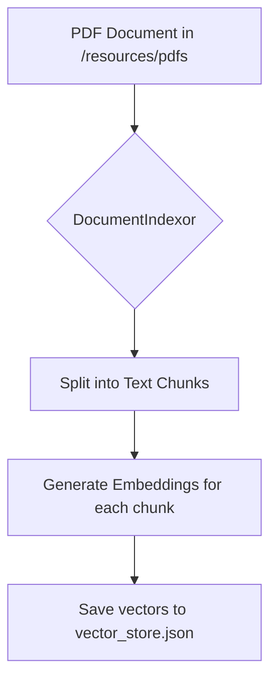
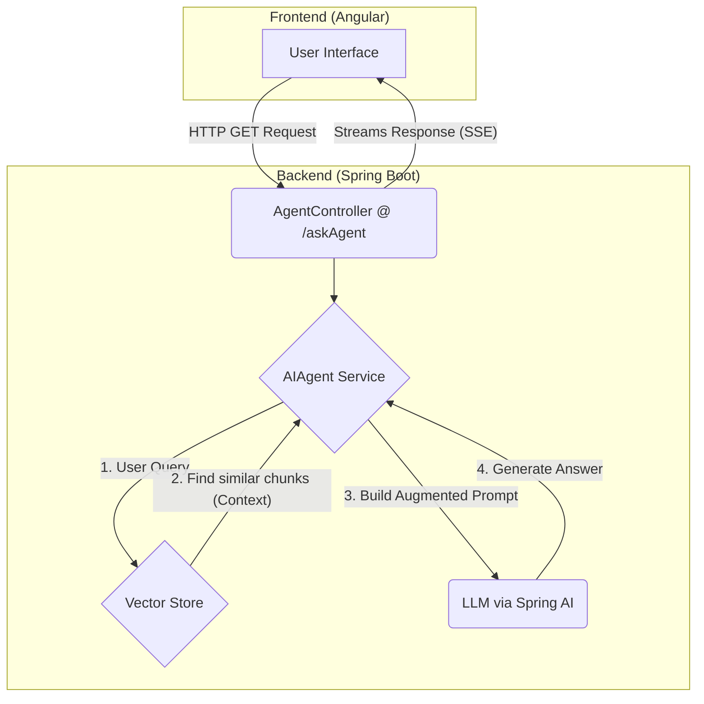

# Spring Agentic AI - RAG Demo

This project is a full-stack application demonstrating the power of **Agentic AI** and **Retrieval-Augmented Generation (RAG)** using a **Spring Boot** backend and an **Angular** frontend.

The application features an AI agent capable of answering questions about a specific document (e.g., a PDF file). It achieves this by first indexing the document into a vector store and then using that context to provide accurate, relevant answers through a Large Language Model (LLM).


## Table of Contents
- [Core Concepts](#core-concepts)
    - [Agentic AI](#agentic-ai)
    - [Retrieval-Augmented Generation (RAG)](#retrieval-augmented-generation-rag)
    - [Vector Store](#vector-store)
- [Application Architecture](#application-architecture)
    - [Indexing Flow (One-Time Setup)](#indexing-flow-one-time-setup)
    - [Querying Flow (Runtime)](#querying-flow-runtime)
- [Project Structure](#project-structure)
- [How to Run the Application](#how-to-run-the-application)
    - [Prerequisites](#prerequisites)
    - [Backend (Spring Boot) Setup](#backend-spring-boot-setup)
    - [Frontend (Angular) Setup](#frontend-angular-setup)
- [API Endpoint](#api-endpoint)

## Core Concepts

### Agentic AI
An "Agent" in this context is more than just a chatbot. It's an AI-powered system that can reason, make decisions, and use a set of predefined **tools** to accomplish a task. In our application, the `AIAgent` can use tools like `EmployeeInfo` to fetch specific data, making it more capable and interactive.

### Retrieval-Augmented Generation (RAG)
RAG is a technique to enhance the quality and factuality of responses from Large Language Models (LLMs). Instead of relying solely on the LLM's pre-trained knowledge (which can be outdated or generic), we provide it with relevant, up-to-date context from our own documents.

The process is:
1.  **Retrieve:** When a user asks a question, we search our knowledge base (the vector store) for the most relevant pieces of information (chunks).
2.  **Augment:** We take these relevant chunks and add them as context to the user's original query.
3.  **Generate:** We send this augmented prompt (Context + Query) to the LLM, which then generates an answer based on the provided information.

### Vector Store
A vector store is a specialized database designed to store data as high-dimensional vectors, also known as **embeddings**. In our project:
- A PDF document is split into smaller text chunks.
- Each chunk is converted into a numerical vector (embedding) using an embedding model.
- These vectors are stored in `resources/store/vector_store.json`.
- The vector store allows for efficient **semantic search**, where we can find text chunks that are most semantically similar to the user's query, rather than just matching keywords.

## Application Architecture

The application is divided into two main processes: a one-time indexing process and the runtime querying process.

### Indexing Flow (One-Time Setup)
This process happens once, typically at application startup, to prepare the knowledge base.


### Querying Flow (Runtime)
This is the live flow when a user interacts with the application.




## Project Structure
Here's a breakdown of the key files and directories in the Spring Boot backend:

```
.
├── agent-ui/                   # Angular frontend project
└── src/
    └── main/
        ├── java/
        │   └── net/samir/bdcc/demospringaiagent/
        │       ├── agents/
        │       │   └── AIAgent.java            # Core agent logic, orchestrates RAG and tool use.
        │       ├── controllers/
        │       │   └── AgentController.java    # REST API endpoint to expose the agent to the frontend.
        │       ├── rag/
        │       │   └── DocumentIndexor.java    # Handles loading the PDF, chunking, and populating the vector store.
        │       ├── tools/
        │       │   ├── AgentTools.java         # A bean defining functions the AI agent can call.
        │       │   └── EmployeeInfo.java       # Example of a specific tool function.
        │       └── DemoSpringAIAgentApplication.java # Main Spring Boot application class.
        │
        └── resources/
            ├── pdfs/                       # Location for source PDF documents to be indexed.
            ├── static/                     # Serves the built Angular application.
            ├── store/
            │   └── vector_store.json       # The file-based vector store.
            ├── templates/                  # Prompt templates for the LLM.
            └── application.properties      # Application configuration (e.g., LLM API keys).
```

## How to Run the Application

### Prerequisites
- Java 17+
- Maven
- Node.js and npm (for the Angular UI)
- An LLM API Key (e.g., from OpenAI, HuggingFace, etc.)

### Backend (Spring Boot) Setup
1.  **Configure API Key:**
    Open `src/main/resources/application.properties` and add your LLM provider's API key. For example, for OpenAI:
    ```properties
    spring.ai.openai.api-key=YOUR_OPENAI_API_KEY
    ```
2.  **Add a PDF:**
    Place the PDF document you want to query inside the `src/main/resources/pdfs/` directory. The `DocumentIndexor` will automatically pick it up.

3.  **Run the application:**
    From the root directory of the project (`demoSpringAIAgent`), run:
    ```bash
    ./mvnw spring-boot:run
    ```
    The backend will start on `http://localhost:8080`. Upon starting, it will index the PDF and create/update `vector_store.json`.

### Frontend (Angular) Setup
1.  **Navigate to the UI directory:**
    ```bash
    cd agent-ui
    ```

2.  **Install dependencies:**
    ```bash
    npm install
    ```

3.  **Run the development server:**
    ```bash
    ng serve
    ```
    The frontend will be available at `http://localhost:4200`. It will automatically connect to the backend running on port 8080.

## API Endpoint
The backend exposes a single primary endpoint for querying the agent.

- **Endpoint:** `GET /askAgent`
- **Description:** Sends a query to the AI agent and streams back the response.
- **Produces:** `text/plain` (as a Server-Sent Events stream)
- **Query Parameter:**
    - `query` (string): The user's question. Defaults to `"Hello"`.

#### Example `curl` Request
```bash
curl "http://localhost:8080/askAgent?query=What is the main topic of the document?"
```

#### Examples Execution


